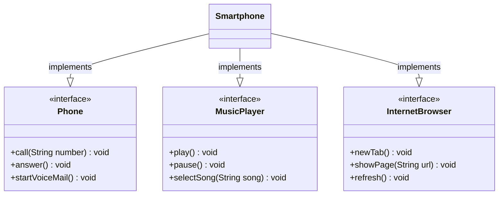

# Diagrama de classes

```mermaid
classDiagram
  class Phone
  <<interface>> Phone
  Phone: +call(String number) void
  Phone: +answer() void
  Phone: +startVoiceMail() void

  class MusicPlayer
  <<interface>> MusicPlayer
  MusicPlayer: +play() void
  MusicPlayer: +pause() void
  MusicPlayer: +selectSong(String song) void

  class InternetBrowser
  <<interface>> InternetBrowser
  InternetBrowser: +newTab() void
  InternetBrowser: +showPage(String url) void
  InternetBrowser: +refresh() void

  class Smartphone
  Smartphone --|> Phone : implements
  Smartphone --|> MusicPlayer : implements
  Smartphone --|> InternetBrowser : implements
```
